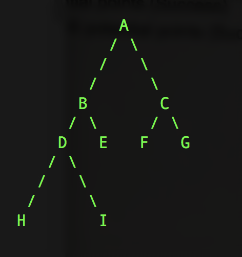

# --- Level 3 ---

Trees are tricky if you don't understand them, just make sure you use recursion to solve these problems.

I invested an hour into understanding how recursively traverse a tree. It was definitely worth my time for another powerful tool under my belt.

A tree is just a linked list with two next values.

Here is what a tree looks like in memory:

